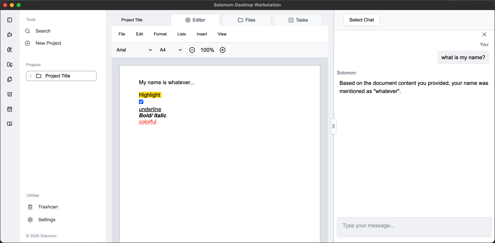

     ____        _                             
    / ___|  ___ | | ___  _ __ ___   ___  _ __  
    \___ \ / _ \| |/ _ \| '_ ` _ \ / _ \| '_ \ 
     ___) | (_) | | (_) | | | | | | (_) | | | |
    |____/ \___/|_|\___/|_| |_| |_|\___/|_| |_|

Welcome!

Our Goal at ACDC.digital is to create a Full-Service workstation which enables ERP (enterprise resource planning) with integrated artificial intellgent assistants. To be a part of our journey, you can begin by following any of the below steps to be a part of our ongoing development:

## Download the App

You can download the latest version of the Solomon Desktop App from our [GitHub Releases page](https://github.com/acdc-digital/solomon-Desktop-App/releases).

## Try our Domain

**Deployment**   
solomon-desktop-33o1isx0l-acdcdigitals-projects.vercel.app

**Domain**   
https://solomon-desktop-app.vercel.app/

## Clone & Install our Repo
**git clone https://github.com/acdc-digital/solomon-Desktop-App.git**

Once cloned ensure you have pnpm installed (if not already): npm install -g pnpm

1. pnpm install
2. spinup Convex backend prior to rundev:
2.1. cd /Users/matthewsimon/Documents/Github/solomon-Desktop-App/packages/renderer
2.2. npx convex dev : install missing dependencies
2.2. [optional/ if necessary] next/ uuid/ node-fetch recurring missing modules**
2.3. [optional/ if necessary]JWT token bug, sometimes need the curlies sometimes not.... ie; import '{' jwtDecode '}' from "jwt-decode";
3. **Optional development mode:** pnpm run dev
4. pnpm run build
5. pnpm run start
6. (note) New dependencies may require the additon of: --legacy-peer-deps

#### Bug Installation Notes
**Note:** currently we're using 'electron-builder' which provides some advanced functionality that will be more important later on during development. electron-builder is a popular alternative for generating more advanced binaries/installers (like .dmg, .exe/NSIS, .AppImage, .deb etc.). The pitfall is that the builder takes a little longer.
**Note2:** I've temporarilty disabled the "prestart": "npm run build" to avoid generating a completely fresh build every time simply to expedite the above concern.   
**Note3:** Occassionally, you may need to manually delete the electron/ dist directory, whereas it could potentially try to load previous 'versions' when updating the version in the package.json - otherwise, I've noted the bugs identified above in the Installation steps.
**Note4:** By restricting the Linux build target to something like "AppImage", electron-builder won’t attempt to create or publish a .snap file, thus avoiding errors about “snapcraft is not installed.”

## Release Notes (development logs)
Our Front-End application is currently being hosted on Vercel, free tier as noted in the domain above.

**Latest Release:**   
v1.2.78   

**Stable Version:**   
v1.1.51   

Our Nextjs front end is hosted on Vercel. The Apple .dmg has been corrected, but is non-secure. Notary has been disabled (temporarily) until a more robust structure can be reviewed for Prodcution. In the meantime, contuing in development-mode for now [scaffolding is there].

#### Git Update Version Main Commands (steps)
1. git add .
2. git commit -m "Updated Electron version to x.x.x"
3. git tag vx.x.x
4. git push origin main vx.x.x
5. (optional) git reset --hard vx.x.x
---
development:
6. git checkout -b *new-branch*
7. git add ./ commit/ push as usual

If you follow these steps, you’ll have a smooth, automated release process.

## Roadmap:
1. [In-Progress] Editor Templates: Note/ Report style templates would allow for easy access to consistent and structured information which could be used for specific chat functions, or training later 
2. Optimized processing for multi-document and Large/Gigantic File-uploads and transfers (currently limited to 25mb/ upload)
3. Tasks: Kanban style task management boards for project specific notes w/ Calendar views
4. Tags: N.E.R (named entity recognition) tagging and highlight tags for in-application File Preview, adding additional context to enhance chat functionality and contextual awareness
5. Browser: In-App Browser Extension for web-browsing and research oriented context scraping
6. R.A.G (retrieval augmented generation) API for external use of proprietary unstructured content processing
7. Collaboration features (organizations and real-time multi-user project editing)
8. ... 

Enjoy!